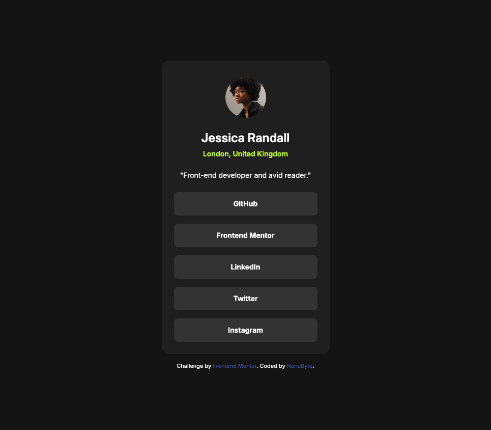

# Frontend Mentor - Social links profile solution

This is a solution to the [Social links profile challenge on Frontend Mentor](https://www.frontendmentor.io/challenges/social-links-profile-UG32l9m6dQ).

## Table of contents

- [Overview](#overview)
  - [Screenshot](#screenshot)
  - [Links](#links)
- [My process](#my-process)
  - [Built with](#built-with)
  - [What I learned](#what-i-learned)
  - [Continued development](#continued-development)
- [Author](#author)
- [Acknowledgments](#acknowledgments)

## Overview

A responsive profile card page showing a developer’s picture, name, location, short description, and a set of social links. The design uses a centered card with consistent typography, color tokens, and hover/active states that adapt to both desktop and mobile.

### Screenshot



### Links

- Solution URL: [Solution](https://github.com/Byte-nana/frontend-mentor-social-links-profile)
- Live Site URL: []()

## My process

### Built with

- Semantic **HTML5**
- **CSS custom properties** for colors and tokens
- **Flexbox** for alignment
- **Mobile-first workflow**
- **Responsive hover/active states** for both desktop and mobile devices
- Google Font: [Inter](https://fonts.google.com/specimen/Inter)

### What I learned

One key learning was how to implement **hover effects that also work on mobile devices**. Normally `:hover` doesn’t translate well on touch screens, but by using media queries with `hover: none` and `pointer: coarse`, I could add `:active` styles for touch devices.

```css
@media (hover: hover) and (pointer: fine) {
  .link:hover {
    background: var(--accent-colour);
    cursor: pointer;
  }
  .link:hover a {
    color: var(--grey-900);
  }
}
@media (hover: none) and (pointer: coarse) {
  .link:active {
    background: var(--accent-colour);
  }
  .link:active a {
    color: var(--grey-900);
  }
}
```

This way, the links feel interactive on both desktop and mobile.

### Continued development

- Explore **accessibility improvements** such as focus styles and ARIA attributes.
- Try creating **component-based CSS structure** (BEM or utility-first) for scaling.

## Author

- GitHub – [Byte-nana](https://github.com/Byte-nana)
- Frontend Mentor – [@Byte-nana](https://www.frontendmentor.io/profile/Byte-nana)

## Acknowledgments

Thanks to Frontend Mentor for providing the design and challenge brief, which guided the structure and styling of this solution.
